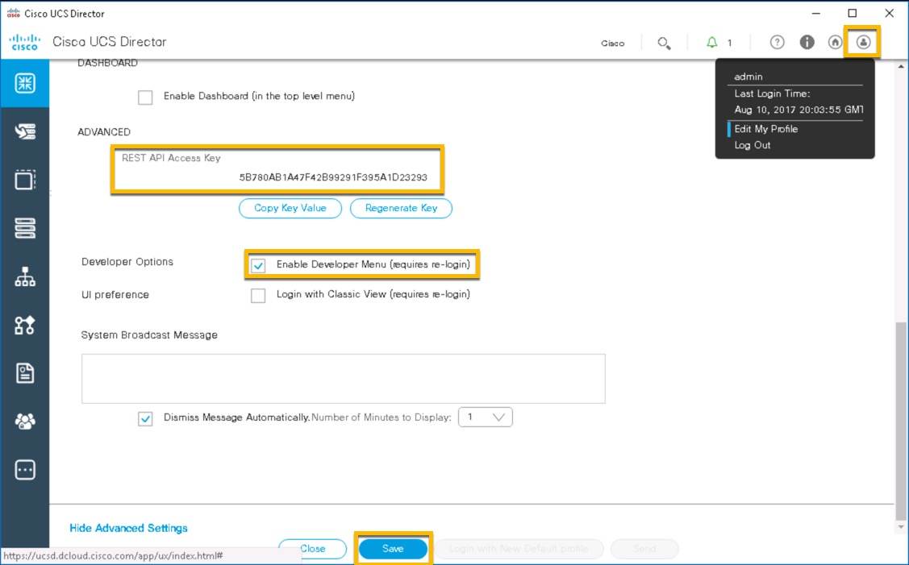
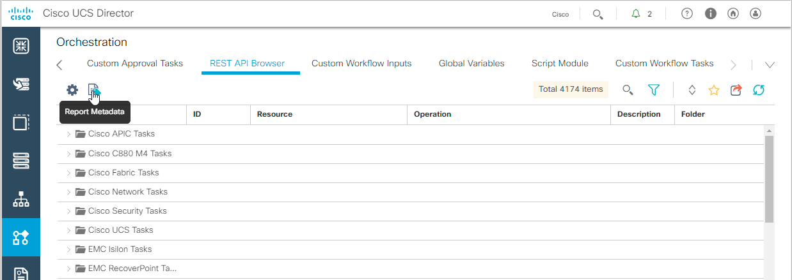
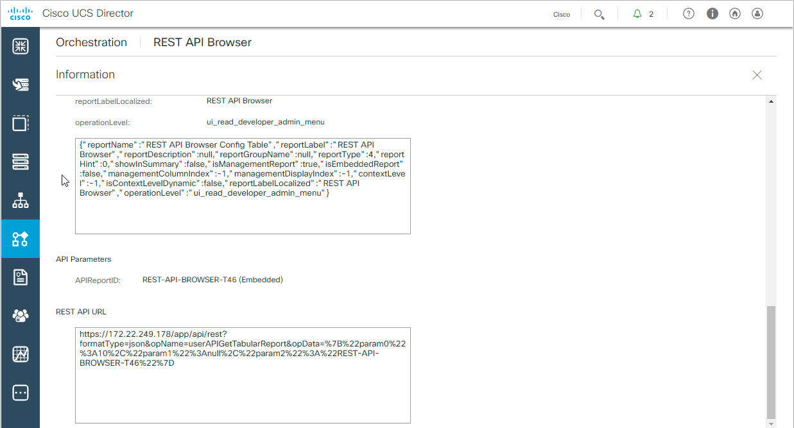
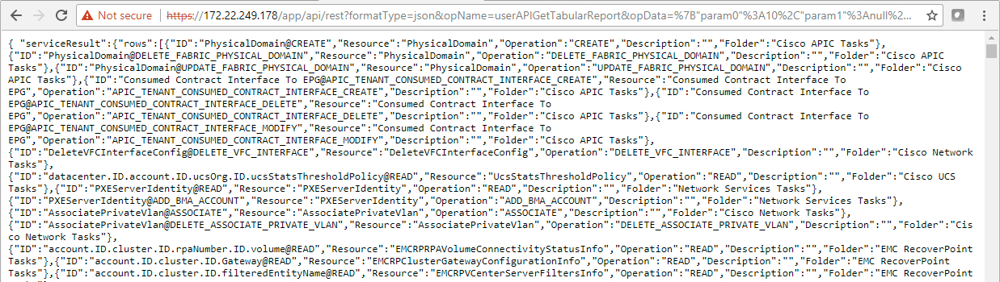
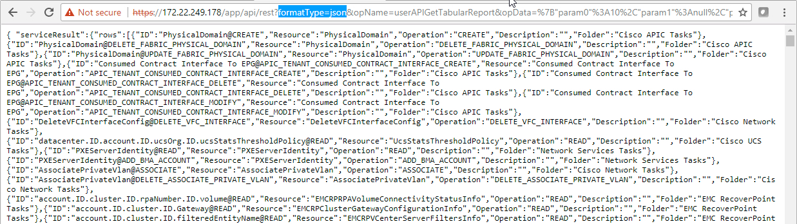
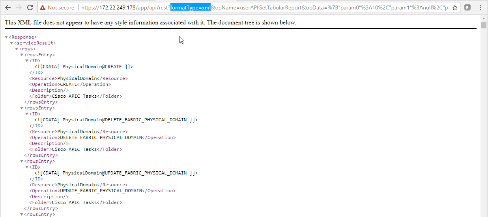

# Introductory UCS Director REST API, Custom Tasks and Workflow Creation Part I

## Overview
Cisco UCS Director is a complete, highly secure, end-to-end management, orchestration, and automation solution for a wide array of Cisco and non-Cisco data center infrastructure components, and for the industry's leading converged infrastructure solutions based on the Cisco UCS and Cisco Nexus platforms. For a complete list of supported infrastructure components and solutions, see the [Cisco UCS Director Compatibility Matrix](http://www.cisco.com/c/en/us/support/servers-unified-computing/ucs-director/products-device-support-tables-list.html).

Cisco UCS Director is a 64-bit appliance that uses the following standard templates:

  - Open Virtualization Format (OVF) for VMware vSphere
  - Virtual Hard Disk (VHD) for Microsoft Hyper-V

Cisco UCS Director extends the unification of computing, network, storage and virtualization layers to provide you with comprehensive visibility and management of your data center infrastructure components. You can use Cisco UCS Director to configure, administer, and monitor supported Cisco and non-Cisco components. The tasks you can perform include the following:

  - Create, clone, and deploy service profiles and templates for all Cisco UCS servers and compute applications.
  - Monitor organizational usage, trends, and capacity across a converged infrastructure on a continuous basis.
  - Deploy and add capacity to converged infrastructures in a consistent, repeatable manner.
  - Manage, monitor, and report on data center components, such as Cisco UCS domains or Cisco Nexus network devices.
  - Extend virtual service catalogs to include services for your physical infrastructure.
  - Manage secure multi-tenant environments to accommodate virtualized workloads that run with non-virtualized workloads.

## Objectives

After completing this lab you will know:

  - What the developer resources within UCS Director GUI
  - What is the UCS Director REST API Access Key
  - How to retrieve your UCS Director REST API Access Key
  - How to query for your user profile
  - How to update your password using the UCS Director REST API

## Prerequisites
Prior to starting this learning lab it would be helpful to understand UCS Director and the functionality that it provides.

An understanding of REST APIs and the utilization of the Postman REST client, would also be helpful.

## UCS Director REST API Documentation
There are several programmatic interfaces available for UCS Director, this lab focuses on the REST API interface, download the [Cisco UCS Director REST API Getting Started Guide](https://www.cisco.com/c/en/us/td/docs/unified_computing/ucs/ucs-director/rest-api-getting-started-guide/6-5/cisco-ucs-director-REST-API-getting-started-65.html) for more detailed information.

When you're ready for the next level be sure to download the [UCS Director REST API Cookbook](https://www.cisco.com/c/en/us/td/docs/unified_computing/ucs/ucs-director/rest-api-cookbook/6-5/cisco-ucs-director-REST-API-cookbook-65.html)

## DevNet Sandbox Lab Infrastructure

To complete the labs in this series you will need access to a UCS Director installation as well as the ability to run [Postman](https://www.getpostman.com/postman). You could setup your own environment ***OR*** you could reserve a [***DevNet UCS Management Sandbox***](https://devnetsandbox.cisco.com/RM/Diagram/Index/3323b7b0-b70b-4b1e-a929-6bdbff3aac8a?diagramType=Topology).

The reservation will take about 20 minutes to setup and can be reserved for up to a week. The UCS Management sandbox provides all the needed infrastructure for this lab as well as several other UCS Management focused Learning Labs.

# Step 1: Finding your UCS Director REST API Access Key, enabling the Developer  menu and checking out some report metadata.

### Exercise 1
Find your user's REST API Access key, turn on the developer options, access and utilize "Report Metadata"

  1. Login to UCS Director, find your user's REST API Key.
    - ***Hover*** over the user icon on the right-hand side of the screen
    - ***Click*** on "Edit My Profile"
    - ***Scroll*** down and Click on "Show Advanced Settings"
    - ***View*** your REST API Access Key, this is where you can copy it from
    - ***Click*** "Enable Developer Menu"
    - ***Click*** "Save"
    - ***Hover*** over the user icon on the right-hand side of the screen
    - ***Click*** on "Log Out"
    - ***Click*** on "Yes, Logout"
    - ***Login***

    

    

  2. When logged back in,
    - ***Click*** on "Orchestration".
    The resulting screen has a new button "Report Metadata", there is also a new tab "REST API Browser".

    

    

  The "REST API Browser" tab is a developer tool that will be explored in Part II of the UCS Director REST API Labs.

  The Report Metadata button appears on almost every UCS Director screen.  The UCS Director screens' row and column layout is considered a report, the Report Metadata shows information (metadata) about what is displayed on the screen.

  ***click*** on Report Metadata and scroll to the bottom of the resulting dialog.  You'll see the bottom section is labeled "REST API URL". Pasting the URL into a browser will result in output in the browser as long as your REST API Access Key is in an HTTP header

    

    

  3. Copy the URL from the REST API URL section, open a new browser tab and paste in the URL and "run" (hit enter) the report. The returned information is in JSON format.

    

    

    

    

  4. In the URL there is a parameter "formatType" set equal to "json", change "json" to "xml" so that the section of the URL looks like this "formatType=xml". Now "re-run" (hit enter) the report and view that the output is now in XML format.

    

    

    

    

  This is the end of Exercise 1

Next Step: Retrieving your UCS Director REST API Access Key, accessing and updating your user profile via the UCS Director REST API.
