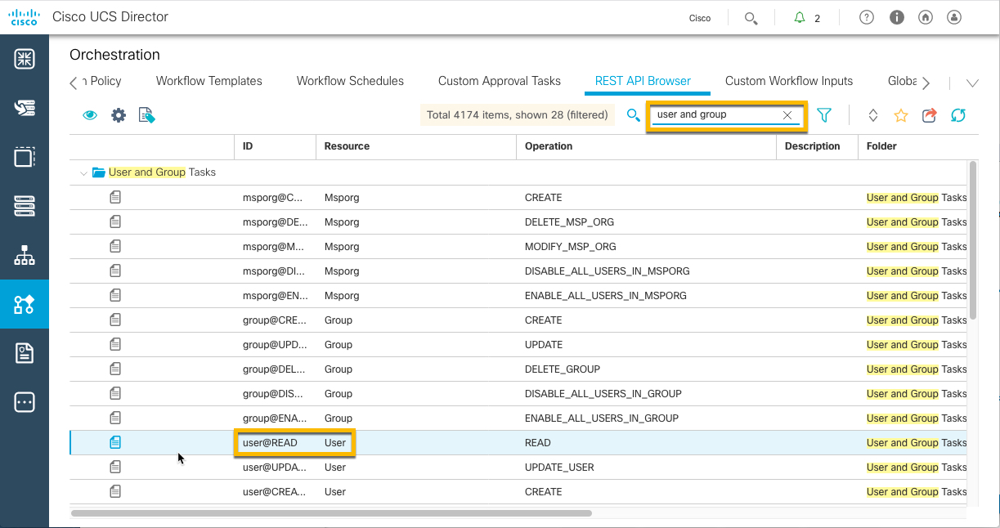

# Introductory UCS Director REST API, Custom Tasks and Workflow Creation Part II

## Overview
Cisco UCS Director is a complete, highly secure, end-to-end management, orchestration, and automation solution for a wide array of Cisco and non-Cisco data center infrastructure components, and for the industry's leading converged infrastructure solutions based on the Cisco UCS and Cisco Nexus platforms. For a complete list of supported infrastructure components and solutions, see the [Cisco UCS Director Compatibility Matrix](http://www.cisco.com/c/en/us/support/servers-unified-computing/ucs-director/products-device-support-tables-list.html).

Cisco UCS Director is a 64-bit appliance that uses the following standard templates:

  - Open Virtualization Format (OVF) for VMware vSphere
  - Virtual Hard Disk (VHD) for Microsoft Hyper-V

Cisco UCS Director extends the unification of computing and network layers through Cisco UCS to provide you with comprehensive visibility and management of your data center infrastructure components. You can use Cisco UCS Director to configure, administer, and monitor supported Cisco and non-Cisco components. The tasks you can perform include the following:

  - Create, clone, and deploy service profiles and templates for all Cisco UCS servers and compute applications.
  - Monitor organizational usage, trends, and capacity across a converged infrastructure on a continuous basis.
  - Deploy and add capacity to converged infrastructures in a consistent, repeatable manner.
  - Manage, monitor, and report on data center components, such as Cisco UCS domains or Cisco Nexus network devices.
  - Extend virtual service catalogs to include services for your physical infrastructure.
  - Manage secure multi-tenant environments to accommodate virtualized workloads that run with non-virtualized workloads.

## Objectives

After completing this lab you will know:

  - What are the UCS Director Developer tools
  - The benefits of the UCS REST API Browser
  - How to use the UCS Director REST API Browser

## Prerequisites
Prior to starting this learning lab it would be helpful to understand UCS Director and the functionality that it provides. Also having completed the UCS Director REST API Learning Lab Part I would be beneficial.

An understanding of REST APIs and the utilization of Postman REST client, would also be helpful.

## UCS Director REST API
Cisco UCS Director REST API is a language-independent interface that can be used by any program or script capable of making HTTP or HTTPS requests. Use the REST API when you want to invoke operations on Cisco UCS Director from a separate program or process.

Applications can use the REST API to do the following:

  - Retrieve Cisco UCS Director reports on physical and virtual devices, networks, appliances, groups and users, policies, resource accounting, funds, and other monitored entities within your Cisco UCS domains.
  - Invoke Cisco UCS Director Orchestrator workflow and task operations.
  - Invoke additional operations specific to Cisco UCS Director.

## UCS Director REST API Documentation
There are several programmatic interfaces available for UCS Director, this lab focuses on the REST API interface, download the [Cisco UCS Director REST API Getting Started Guide](https://www.cisco.com/c/en/us/td/docs/unified_computing/ucs/ucs-director/rest-api-getting-started-guide/6-5/cisco-ucs-director-REST-API-getting-started-65.html) for more detailed information.

When you're ready for the next level be sure to download the [UCS Director REST API Cookbook](https://www.cisco.com/c/en/us/td/docs/unified_computing/ucs/ucs-director/rest-api-cookbook/6-5/cisco-ucs-director-REST-API-cookbook-65.html)

# Step 1: Accessing and Using the UCS Director REST API Browser.

### Exercise 1
The UCS Director REST API Browser is available only when the "Enable Developer Menu" checkbox on the "Advanced" tab is ***checked*** in the user profile. Please refer to Exercise 1 in ucsd-rest-api-101 lab.

    

    

Let's explor the UCS Director REST API Browser

  1. Access the UCS Director REST API browser

    - ***Click*** on "Orchestration"
    - ***Click*** on the "REST API Browser" tab if it is not already the current tab. Or access the "REST API Browser" tab from the *right-hand* drop-down menu.

    

    

  2. Access the **User and Group Tasks**

    - Type "user and group" into the search field on the right hand side. The display will update to show an expanded "User and Group Tasks".
    - ***Double-Click*** on the task with the **ID** "user@READ"

    

    

  The "API Examples" tab shows the REST API resource URL for UCS Director Users.

    

    

  3. Execute the UCS Director REST API for "user@READ"

    - ***Click*** the "Execute REST API" button to issue a GET for the resource URL `/cloupia/api-v2/user`, resulting in output in XML format of all the users of UCS Director.

    

    

  4. The Resource URL can be modified to retrieve a single user by specifying the user id at the end of the URL.

  Change the resource URL to retrieve the *admin* user

    - ***Enter*** this URL `/cloupia/api-v2/user/admin`
    - ***Click*** the Execute REST API button to retrieve just a single user, in this case the *admin* user.

    

    

  Now only the *admin* user information is displayed.

  This is the end of Exercise 1

### Exercise 2
View the other tabs in the REST API Browser.

  1. View the Details tab.

    - ***Click*** on the "Details" tab.

    

    

  The "Details" tab provides

    - API Definition
    - Input Parameters Definition
    - Output Parameters Definition

  2. View the "Sample Java Code"tab.

    - ***Click*** on the "Sample Java Code" tab.

    

    

  This tab displays the Java code that would be utilized to make the same REST API call in Java.

  3. Close the REST API Browser for the "user@READ" Task

   - ***Click*** the "Close" button to exit the "user@READ" task information.

   or

   - ***Click*** the "X" in the upper right-hand corner to exit the "user@READ" task information.

  This is the end of Exercise 2.

Next Step: Use the UCS Director REST API to Create, Update and Delete a UCS Director User.
