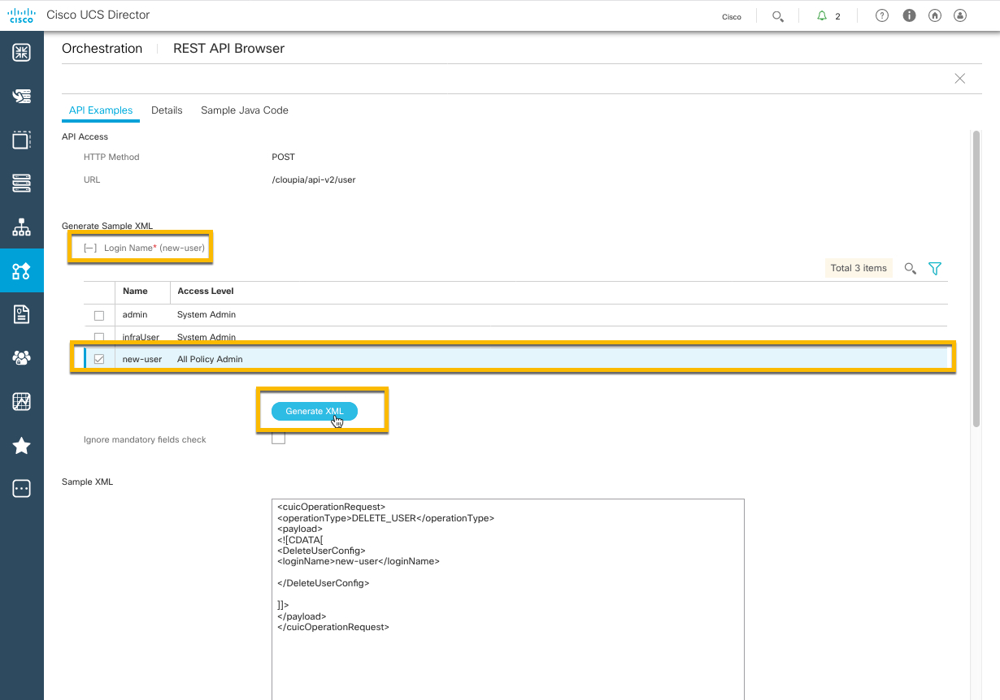

# Introductory UCS Director REST API, custom tasks and workflow creation part II

# Step 2: Using the UCS Director REST API Browser to create, update and delete a UCS Director User.

### Exercise 3
Use the REST API Browser to create, update, and delete a user.

  1. Create a UCS Director user. Double-Click the task with the **ID** **user@CREATE**.

      

  2. On the **API Examples** tab, enter the following values:

    - Login Name — `new-user`
    - Password — `cisco123`
    - Confirm Password — `cisco123`
    - User Contact Email — `new-user@company.com`

      

  3. Generate the XML that is used to create the user. Click the Generate XML button.

      

  4. Execute the **user@CREATE** REST API. Click the Execute REST API button.

      

      

  If everything was entered correctly, you will see a success message in the Response window. If there was an error with the request, then an error is displayed in the response window.

  5. Return to the REST API Browser Task selection screen. Click the **Close** button or the "X" in the *upper-right* corner.

  6. Update a UCS Director user. Double-Click the task with the **ID** **user@UPDATE_USER**.

      

  7. Select the user and enter the following values:

    - Click "+" next to **Login Name* ** to expand the user selection section.
    - Check "box" next to the user **new-user**.
    - Click the **Validate** button; this will fill in the **User Contact Email** field.
    - Enter First Name - `New`.
    - Enter Last Name - `User`.

      

  8. Generate the XML that is used to update the user. Click the Generate XML button.

      

  9. Execute the *user@CREATE* REST API. Click the Execute REST API button.

      

  10. Return to the REST API Browser Task selection screen. Click the **Close** button or the "X" in the *upper-right* corner.

  11. Verify that the user **new-user** was updated:

    - Double-Click the task with the **ID** "user@READ".
    - Add `new-user` to the end of the Resource URL.
    - Click the "Execute REST API button".
    - Verify that first name `New` and the last name `User` were updated for the user.

    - The Resource URL should look like this:

      `/cloupia/api-v2/user/new-user`

      

  12. Return to the REST API Browser Task selection screen. Click the **Close** button or the "X" in the *upper-right* corner.

  13. Delete a UCS Director Users:

    - Double-click on the task with the **ID**.
    - Click "+" next to "Login Name*" to expand the user selection section.
    - Check "box" next to the user **new-user**.
    - Click the **Generate XML** button.
    - Click the **Execute REST API*** button.

      

      

  View the successful deletion message for user *new-user*.

  This is the end of Exercise 3.

This concludes the **UCS Director REST API, custom tasks and workflow creation part II lab**.
