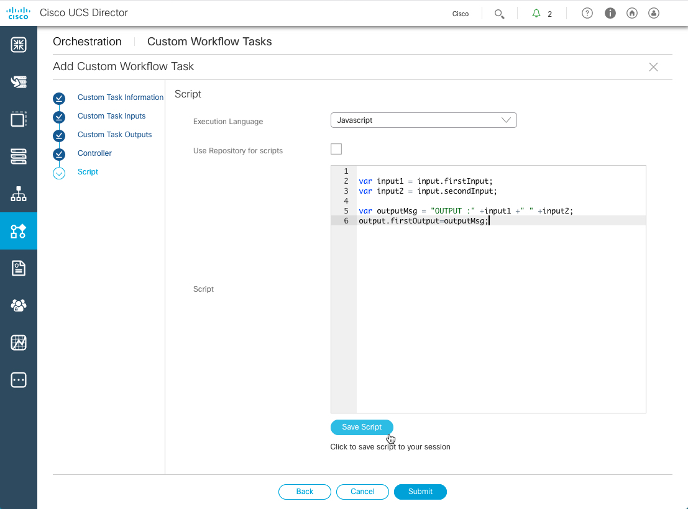

# Introductory UCS Director REST API, custom tasks, and workflow creation part III

## Overview
Cisco UCS Director is a complete, highly secure, end-to-end management, orchestration, and automation solution for a wide array of Cisco and non-Cisco data center infrastructure components. It's also used for the industry's leading converged infrastructure solutions based on the Cisco UCS and Cisco Nexus platforms. For a complete list of supported infrastructure components and solutions, see the [Cisco UCS Director Compatibility Matrix](http://www.cisco.com/c/en/us/support/servers-unified-computing/ucs-director/products-device-support-tables-list.html).

Cisco UCS Director is a 64-bit appliance that uses the following standard templates:

  - Open Virtualization Format (OVF) for VMware vSphere.
  - Virtual Hard Disk (VHD) for Microsoft Hyper-V.

Cisco UCS Director extends the unification of computing and network layers through Cisco UCS to provide you with comprehensive visibility and management of your data center infrastructure components. You can use Cisco UCS Director to configure, administer, and monitor supported Cisco and non-Cisco components. The tasks you can perform include the following:

  - Create, clone, and deploy service profiles and templates for all Cisco UCS servers and compute applications.
  - Monitor organizational usage, trends, and capacity across a converged infrastructure on a continuous basis.
  - Deploy and add capacity to converged infrastructures in a consistent, repeatable manner.
  - Manage, monitor, and report on data center components, such as Cisco UCS domains or Cisco Nexus network devices.
  - Extend virtual service catalogs to include services for your physical infrastructure.
  - Manage secure multi-tenant environments to accommodate virtualized workloads that run with non-virtualized workloads.

## Objectives

  After completing this lab you will know:

  - How to create a custom workflow tasks.
  - How to create a workflow to use the custom task.
  - How to call the workflow via the UCS Director REST API.

## Prerequisites
Prior to starting this learning lab it would be helpful to understand UCS Director and the functionality that it provides. Also having completed the [UCS Director REST API Learning Lab Part I](https://learninglabs.cisco.com/lab/ucsd-rest-api-101/step/1) and [Part II](https://learninglabs.cisco.com/lab/ucsd-rest-api-102/step/1) would be beneficial.

An understanding of REST APIs, and the utilization of Postman REST client would also be helpful.

## UCS Director REST API
Cisco UCS Director REST API is a language-independent interface that can be used by any program or script capable of making HTTP or HTTPS requests. Use the REST API when you want to invoke operations on Cisco UCS Director from a separate program or process.

Applications can use the REST API to do the following:

  - Retrieve Cisco UCS Director reports on physical and virtual devices, networks, appliances, groups and users, policies, resource accounting, funds, and other monitored entities within your Cisco UCS domains.
  - Invoke Cisco UCS Director Orchestrator workflow and task operations.
  - Invoke additional operations specific to Cisco UCS Director.

## UCS Director REST API documentation

There are several programmatic interfaces available for UCS Director. This lab focuses on the REST API interface; download the [Cisco UCS Director REST API Getting Started Guide](https://www.cisco.com/c/en/us/td/docs/unified_computing/ucs/ucs-director/rest-api-getting-started-guide/6-5/cisco-ucs-director-REST-API-getting-started-65.html) for more detailed information.

When you're ready for the next level be sure to download the [UCS Director REST API Cookbook](https://www.cisco.com/c/en/us/td/docs/unified_computing/ucs/ucs-director/rest-api-cookbook/6-5/cisco-ucs-director-REST-API-cookbook-65.html).

## DevNet Sandbox lab infrastructure

To complete the labs in this series you will need access to a UCS Director installation as well as the ability to run [Postman](https://www.getpostman.com/postman). You could setup your own environment ***OR*** you could reserve a [*DevNet UCS Management Sandbox*](https://devnetsandbox.cisco.com/RM/Diagram/Index/3323b7b0-b70b-4b1e-a929-6bdbff3aac8a?diagramType=Topology).

The reservation will take about 20 minutes to setup and can be reserved for up to a week. The UCS Management sandbox provides all the needed infrastructure for this lab as well as several other UCS Management focused Learning Labs.

# Step 1: Creating a custom workflow task

### Exercise 1
Workflows are the key to UCS Director. A workflow allows you to organize tasks both included and customized into a flow to orchestrate and automate a process.  Potentially, all the tasks you need are already available in UCS Director; for those tasks that do not exist a custom one can be created.

  1. Create a Custom Workflow Task:

    - Click **Orchestration**.
    - Click **Custom Workflow Tasks** tab if it is not already the current tab or select it from the *right-hand* drop-down menu.
    - Click `Add` to add a custom workflow task.
    - Enter Task Name - `SimpleCustomTask`.
    - Enter Task Label - `Demonstrate Custom Task`.
    - Enter Register Under Category - `Testing Custom Task`.
    - Check `Activate Task`.
    - Click `Next`.</br></br>


  <br/><br/>

  <br/><br/>

  <br/><br/>

  2. Add Custom Task Inputs:

    - Click **+** next to **Inputs** to expand the Inputs section.
    - Click **+** to add a new entry to the **Inputs** table.
    - Enter Input Field Name - `firstInput`.
    - Enter Input Field Label - `Enter the first input`.
    - Select Input Field Type - `Text`.
    - Click **+** next to **Map to Input Type**.
    - Click Magnifying Glass icon.
    - Enter in Search Field **generic text input**.
    - Check checkbox next to **Generic Text Input**.
    - Check **Mandatory** checkbox.
    - Click `Submit`.</br></br>

  <br/><br/>

  <br/><br/>

  Add another Custom Input:

    - Click **+** next to **Inputs** to expand the Inputs section.
    - Click **+** to add a new entry to the **Inputs** table.
    - Enter Input Field Name - `secondInput`.
    - Enter Input Field Label - `Enter the second input`.
    - Select Input Field Type - `Text`.
    - Click **+** next to **Map to Input Type**.
    - Click  Magnifying Glass icon.
    - Enter in Search Field **generic text input**.
    - Check checkbox next to **Generic Text Input**.
    - Check "Mandatory" checkbox.
    - Click`Submit`.</br></br>

  The resulting screen should look like this image:

    <br/><br/>

    Now click `Next`.</br></br>

  3. Add Custom Task Outputs:

    - Click **+** next to **Outputs** to expand the Outputs section.
    - Click **+** to add a new entry to the **Outputs** table.
    - Enter Output Field Name - `firstOutput`.
    - Enter Output Field Description - `First Output`.
    - Click **+** next to **Output Field Type**.
    - Click  Magnifying Glass icon.
    - Enter in Search Field **generic text input**.
    - Check checkbox next to **Generic Text Input**.
    - Click `Submit`.</br></br>

    <br/><br/>

    The resulting screen should look like this image:

    <br/><br/>

Now click **Next**.</br></br>

  4. Skip Controllers:

  Custom Task Controllers are not covered in this lab.

  Now click **Next**.</br></br>

  5. Add a Custom Task script:

    - Enter the following into the script field:

  ```javascript
  var input1 = input.firstInput;
  var input2 = input.secondInput;

  var outputMsg = "OUTPUT :" +input1 + " " +input2;
  output.firstOutput=outputMsg;
  ```

  <br/><br/>

    - Click **Save Script** button.
    - Click **Submit**.</br></br>
  The task is added to the bottom of the list. Either scroll to the bottom of the list, or change the sort order of the `ID` column by clicking on the column header.

  <br/><br/>

  The Custom Task has been added and saved; it is now available for utilization in a UCS Director Workflow.

  This is the end of Exercise 1.

Next Step: Creating a UCS Director Workflow to utilize the custom task.
