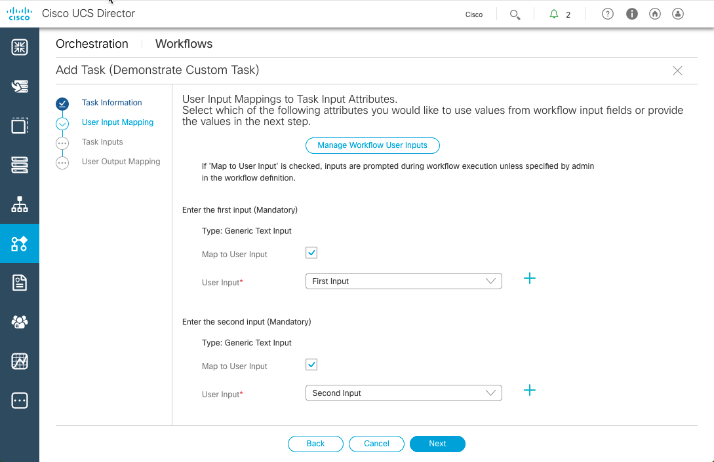
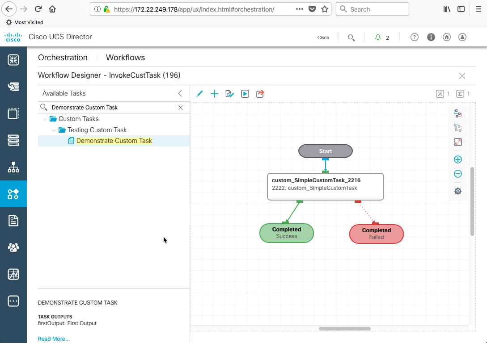

# Introductory UCS Director REST API, Custom Tasks and Workflow Creation Part III

# Step 2: Creating a UCS Director Workflow to Utilize the Custom Task.

### Exercise 2

  1. Add a UCS Director Workflow

    - ***Click*** - "Orchestration"
    - ***Click*** - "Workflows" tab if it is not already the current tab or select it from the *right-hand* drop-down menu.
    - ***Click*** - `Add Workflow`
    - ***Enter*** - "Workflow Name" - `InvokeCustTask`
    - ***Enter*** - "Description" - `Demonstrate how to add custom task as a part of workflow`
    - ***Check*** - "Save Options:Place in New Folder"
    - ***Enter*** - "Save Options:Folder Name" - `Training`
    - ***click*** `Next`  

    

    

    

    

  2. Add Workflow User Inputs.

    - ***Click*** - "+" to add a new entry to the "User Inputs" table
    - ***Enter*** - Input Label - `First Input`
    - ***Enter*** - Input Description - `First Input`
    - ***Click*** - "+" next to "Input Type"
    - ***Click*** - Magnifying Glass icon
    - ***Enter*** - in Search Field “generic text input”
    - ***Check*** - checkbox next to "Generic Text Input"
    - ***Click*** - `Validate` button
    - ***Click*** `Submit`  

    

    

    

    

  Add another Workflow User Input

    - ***Click*** - "+" to add a new entry to the "User Inputs" table
    - ***Enter*** - Input Label - `Second Input`
    - ***Enter*** - Input Description - `Second Input`
    - ***Click*** - "+" next to "Input Type"
    - ***Click*** - Magnifying Glass icon
    - ***Enter*** - in Search Field “generic text input”
    - ***Check*** - checkbox next to "Generic Text Input"
    - ***Click*** - `Validate` button
    - ***Click*** `Submit`  

  The resulting screen should look like the image below.

    

    

    - ***Click*** `Next`  

  3. Add Workflow User Outputs

    - ***Click*** - "+" to add a new entry to the "User Outputs" table
    - ***Enter*** - Output Label - `Workflow Output`
    - ***Enter*** - Input Description - `Workflow Output`
    - ***Click*** - "+" next to "Output Type"
    - ***Click*** - Magnifying Glass icon
    - ***Enter*** - in Search Field “generic text input”
    - ***Check*** - checkbox next to "Generic Text Input"
    - ***Click*** - `Validate` button
    - ***Click*** `Submit`  

    

    

    

    

  The resulting screen should look like the image below,

    

    

   - ***Click*** `Submit` to add the workflow and open the "Workflow Designer".  

  4. Add Custom Task to Workflow

    - ***Enter*** - in Search Field - `Demonstrate Custom Task`
    - ***Drag*** - Task - `Demonstrate Custom Task` to the designer space.  

    

    

  The "Add Task" dialog will open

    - ***Click*** `Next` to accept values on current screen

    

    

  5. Configure User Input Mapping

    - In the section "Enter the first input"
      - ***Check*** "Map to User Input"
      - ***Select*** "First Input"  
    - In the section "Enter the second input"
      - ***Check*** "Map to User Input"
      - ***Select***  "Second Input"  
    - ***Click*** `Next`

    

    

  6. Task Inputs

    - ***Click*** `Next`  

  7. User Output Mapping

    - In the section "firstOutput"
      - ***Check*** "Map to User Input"
      - ***Select*** "Workflow Output"  
    - ***Click*** `Submit`  

    

    

  The custom task has been added to the workflow

    

    

  8. Validate and Save the Workflow

    - ***Click*** - "Validate" icon, "The workflow is valid" message will appear
    - ***Click*** - "X" in the *upper right-hand* corner to close the "Workflow Designer"  

      

      

      

      

  9. View the Workflow

    - ***Expand*** the "Training" folder to view the "InvokeCustTask" workflow that was just added.

    

    

  This is the end of Exercise 2.

Next Step: Invoking a UCS Director Workflow
