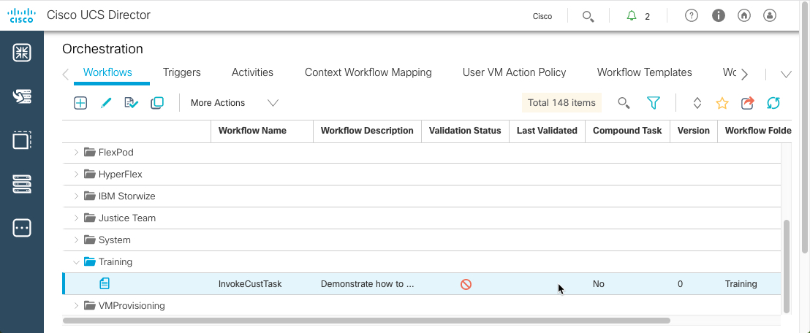

# Introductory UCS Director REST API, custom tasks and workflow creation part III

# Step 3: Invoking a UCS director workflow manually, and via the UCS Director REST API

### Exercise 3

  1. Execute the "InvokeCustTask" workflow:

    - Click "InvokeCustTask".
    - Click "Execute Now".

  <br/><br/>

  <br/><br/>

  <br/><br/>

  <br/><br/>

  2. Enter Values to Run Workflow:

    - Enter "First Input" - `New`.
    - Enter "Second Input" - `User`.
    - Click `Submit`.<br/><br/>

  <br/><br/>


  <br/><br/>


  3. View the Workflow status: Click "Show Detail Status" button.


  <br/><br/>

  4. View the Workflow Inputs and Outputs:

    - Click "Input/Output" tab.
    - Expand "Demonstrate Custom Task" section.
    - View the output from the custom task is "New User".<br/><br/>


  <br/><br/>

  This is the end of Exercise 3.

### Exercise 4

  Execute the "InvokeCustTask" Workflow from the UCS Director REST API.

  To invoke a UCS Director workflow via the REST API, use the `userAPISubmitWorkflowServiceRequest` opName, supplying the user inputs as parameters in the opData JSON structure:

  `http://<ucsd-ip>/app/api/rest?formatType=json
                 &opName=userAPISubmitWorkflowServiceRequest
                 &opData={json-structure}`

  The JSON structure is formatted as follows.

  ```json
  {
    param0:"<workflow-name>",
    param1:{
      "list":[
        {"name":"<input-1>","value":"<input-value>"},
        {"name":"<input-1>","value":"<input-value>"}
      ]
    },
    param2:-1
}
  ```

  1. Retrieve the REST API Access Key:

  In Postman retrieve your REST API Access Key, and add the *X-Cloupia-Request-Key* header. Refer to learning lab [UCS Director REST API Part I](https://learninglabs.cisco.com/lab/ucsd-rest-api-103/step/1) for the operations to retrieve your REST API Access Key and create the *X-Cloupia-Request-Key* header.

  <br/><br/>

  2. Set Appropriate Values for REST API call:

  Use the JSON data to execute the "InvokeCustTask" workflow, and output the value "Another User":

  ```json
  {param0:"InvokeCustTask",param1:{"list":[{"name":"First Input","value":"Another"},{"name":"Second Input","value":"User"}]},param2:-1}
  ```

  The entire URL is:

  `https://<ucsd-ip>/app/api/rest?formatType=json&opName=userAPISubmitWorkflowServiceRequest&opData={param0:"InvokeCustTask",param1:{"list":[{"name":"First Input","value":"Another"},{"name":"Second Input","value":"User"}]},param2:-1}`


  <br/><br/>

  The status that is returned contains the UCS Director Service Request number. The Service Request details provide access to the output from the workflow.


  3. View REST API Call Status as a UCS Director Service Request:

    - Hover over "Organizations".
    - Click "Service Requests".
    - Double-Click The correct "Service Request".


  <br/><br/>


  4. View the Workflow Status and Inputs and Outputs:

    - View "Workflow Status" tab.
    - Click "Input/Output" tab.
    - Expand "Demonstrate Custom Task" section.
    - View the output from the custom task is "New User".<br/><br/>


  <br/><br/>


  <br/><br/>
  This is the end of Exercise 4.


This concludes the **UCS Director REST API, custom tasks and workflow creation part III lab**.
